<div align="center">

# 👋 Hi, I'm **Liliana**

### `Tech Lead` at Kodify · Building high-traffic media platforms

[](https://github.com/L1l1AnA)
[](https://www.linkedin.com/in/lilianamunoz/)

</div>

---

## 🎯 What I do

I bridge **technical execution and business goals** — making architecture decisions, ensuring code quality, and mentoring engineers while keeping delivery on track.

- 🏗️ Define and drive **technical direction** across microservice ecosystems
- 👥 **Mentor and grow** engineering teams through code reviews, pairing, and design discussions
- 📐 Make **high-level architecture decisions** for distributed systems at scale
- 🔗 Facilitate communication between **engineering, product, and stakeholders**
- ⚡ Balance **technical debt vs. delivery** — knowing when to refactor and when to ship

## 🔧 Tech Stack

```text
Backend:        Node.js · TypeScript · Express
Frontend:       React · Next.js
Databases:      MongoDB · MySQL · Redis · OpenSearch/Elasticsearch
Messaging:      RabbitMQ · AWS Kinesis
Infrastructure: Docker · Cloudflare Workers/Pages · AWS · GitHub Actions
Video:          Video.js · Zencoder · FFmpeg
```

## 🧰 Hands-on work

- 🔧 Build and maintain **distributed backend services**
- 🎨 Develop frontend experiences with **React, Next.js**, and **Cloudflare Pages**
- 🐳 Design **Docker-based dev environments** for large microservice ecosystems
- 🛠️ Create **developer tooling** (Chrome extensions, CLI utilities)
- 🎬 Work on **video processing pipelines** and player components

## 📊 GitHub Stats

<div align="center">





</div>

---

<div align="center">

*"First do it, then do it right, then do it better."*


</div>
